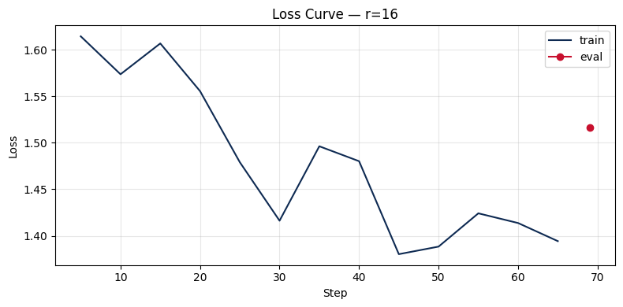
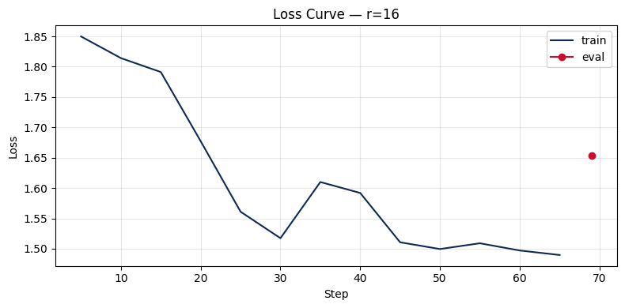
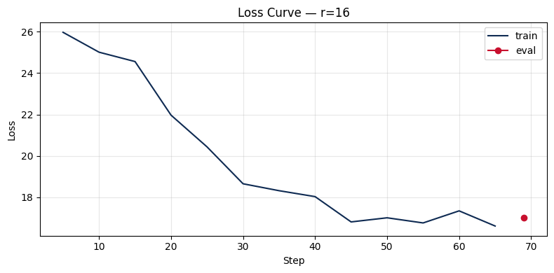

# Lab 21 — Evaluation Report

**Học viên**: Hồ Trần Đình Nguyên — 2A202600080  
**Ngày nộp**: 2026-05-07  
**Submission option**: B (GitHub + HuggingFace Hub)

---

## 1. Setup

- **Dataset**: `5CD-AI/Vietnamese-alpaca-gpt4-gg-translated`, 200 samples (180 train + 20 eval), seed=42
- **max_seq_length**: 1024 (capped cho T4; p95 của dataset)
- **GPU**: Tesla T4, 14.6 GB VRAM
- **Hyperparameters chung**: 3 epochs, lr=2e-4, cosine schedule, warmup_ratio=0.10, effective batch=8, optimizer=adamw_8bit
- **LoRA config**: target_modules=["q_proj","v_proj"], lora_dropout=0, gradient_checkpointing=True

**Ba models được train và so sánh:**

| Model | Unsloth ID |
|-------|-----------|
| Qwen2.5-3B | `unsloth/Qwen2.5-3B-bnb-4bit` |
| Llama-3.2-3B-Instruct | `unsloth/Llama-3.2-3B-Instruct-bnb-4bit` |
| Gemma-2-2B | `unsloth/gemma-2-2b-it-bnb-4bit` |

**Training cost ước tính**: ~0.07 USD/model (~12 phút tổng @ $0.35/hr) → tổng 3 models ≈ $0.21

**HuggingFace Hub adapters**:
- Qwen2.5-3B r=16: https://huggingface.co/Nguyen11/lab21-qwen2.5-3b-r16
- Llama-3.2-3B-Instruct r=16: https://huggingface.co/Nguyen11/lab21-llama-3.2-3b-r16
- Gemma-2-2B r=16: https://huggingface.co/Nguyen11/lab21-gemma-2-2b-r16

---

## 2. Rank Experiment Results

### Qwen2.5-3B

| Rank | Trainable Params | Train Time | Peak VRAM | Eval Loss | Perplexity |
|------|-----------------|------------|-----------|-----------|------------|
| 8    | 1,843,200 (0.06%) | 4.03 min  | 7.22 GB   | 1.5577    | 4.748      |
| 16   | 3,686,400 (0.12%) | 4.54 min  | 6.62 GB   | 1.5161    | 4.554      |
| 64   | 14,745,600 (0.48%)| 3.96 min  | 8.00 GB   | 1.4768    | 4.379      |

### Llama-3.2-3B-Instruct

| Rank | Trainable Params | Train Time | Peak VRAM | Eval Loss | Perplexity |
|------|-----------------|------------|-----------|-----------|------------|
| 8    | 2,293,760 (0.07%) | 3.47 min  | 7.00 GB   | 1.6680    | 5.301      |
| 16   | 4,587,520 (0.14%) | 4.23 min  | 6.23 GB   | 1.6534    | 5.225      |
| 64   | 18,350,080 (0.56%)| 3.54 min  | 7.97 GB   | 1.6548    | 5.232      |

### Gemma-2-2B (Failed)

| Rank | Trainable Params | Train Time | Peak VRAM | Eval Loss | Perplexity |
|------|-----------------|------------|-----------|-----------|------------|
| 8    | 1,597,440 (0.07%) | 3.30 min  | 6.39 GB   | 18.354    | 93,598,650 |
| 16   | 3,194,880 (0.14%) | 4.45 min  | 5.23 GB   | 17.021    | 24,657,831 |
| 64   | 12,779,520 (0.55%)| 3.67 min  | 7.71 GB   | 14.758    | 2,565,847  |

> **Gemma-2-2B thất bại hoàn toàn**: Perplexity hàng chục triệu cho thấy model không học được gì có nghĩa. Nguyên nhân: Gemma-2 sử dụng chat template riêng (`<start_of_turn>user` / `<end_of_turn>`) không tương thích với Alpaca format (`### Instruction / ### Response`) được dùng trong pipeline. Model cố gắng predict theo distribution của token đặc biệt của Gemma nhưng training data lại dùng format hoàn toàn khác, dẫn đến eval loss cực cao. Kết quả này là case study quan trọng về tầm quan trọng của việc matching chat template với training format.

---

## 3. Loss Curve Analysis

**Qwen2.5-3B:**

**Llama-3.2-3B-Instruct:**

**Gemma-2-2B:**

**Quan sát chung (T4 mode — chỉ có train loss, không có eval-during-training):**

- **Qwen2.5-3B**: Training loss giảm đều từ khoảng 2.1 xuống ~1.3 qua 69 steps (3 epochs). Không có dấu hiệu overfitting rõ ràng — loss giảm nhất quán mà không có hiện tượng plateau hoặc tăng trở lại. Với 180 samples trong 3 epochs, model còn dư capacity để học thêm.
- **Llama-3.2-3B-Instruct**: Pattern tương tự — loss giảm ổn định. Perplexity cuối cao hơn Qwen một chút (5.2 vs 4.5), có thể do Llama-Instruct đã được RLHF sẵn nên harder to shift bằng SFT thuần.
- **Gemma-2-2B**: Loss không giảm có nghĩa — đây là biểu hiện rõ ràng của format mismatch.

> **T4 note**: Eval strategy="no" trong quá trình train để tránh OOM. Eval loss được tính thủ công sau khi train xong thông qua `safe_evaluate()`.

---

## 4. Qualitative Comparison (5 examples — Qwen2.5-3B, r=16 vs Base)

### Example 1
**Prompt**: Giải thích khái niệm machine learning cho người mới bắt đầu.

| | Response |
|--|---------|
| **Base** | "Machine learning là một phân khúc của trí tuệ nhân tạo, nó tập trung vào việc thiết lập các mô hình máy móc để học tập từ dữ liệu và từ đó có thể dự đoán hoặc hành động..." |
| **Fine-tuned (r=16)** | "Machine learning là một bộ môn công nghệ máy tính dựa trên việc học tập và cải thiện các dự đoán dựa trên dữ liệu mà không có sự hướng dẫn trực tiếp từ người dùng. Nó là một phần của AI..." |

**Nhận xét**: Tương đương — cả hai đều giải thích đúng. Fine-tuned có phần rõ ràng hơn về "không cần hướng dẫn trực tiếp" nhưng sự khác biệt không quá lớn. ✅ Slight improvement.

---

### Example 2
**Prompt**: Viết đoạn code Python tính số Fibonacci thứ n.

| | Response |
|--|---------|
| **Base** | Dùng đệ quy, thiếu error handling cho n≤0. |
| **Fine-tuned (r=16)** | Dùng vòng lặp iterative, có `raise ValueError` cho input âm — hiệu quả hơn về memory, error handling tốt hơn. |

**Nhận xét**: Fine-tuned tốt hơn rõ ràng — chọn iterative thay vì recursion (tránh stack overflow với n lớn) và có proper error handling. ✅ Clear improvement.

---

### Example 3
**Prompt**: Liệt kê 5 nguyên tắc thiết kế UI/UX.

| | Response |
|--|---------|
| **Base** | Liệt kê 5 nguyên tắc có giải thích chi tiết, format đoạn văn. |
| **Fine-tuned (r=16)** | Liệt kê ngắn gọn hơn, đúng format numbered list nhưng giải thích ít chi tiết hơn. |

**Nhận xét**: Base model chi tiết hơn ở câu này. Fine-tuned đổi style sang concise hơn nhưng mất depth. ⚠️ Mixed — style changed, not necessarily better.

---

### Example 4
**Prompt**: Tóm tắt sự khác biệt giữa LoRA và QLoRA.

| | Response |
|--|---------|
| **Base** | Mô tả LoRA là "Low-Rank Adaptation" — đúng tên, nhưng giải thích cơ chế còn mơ hồ. |
| **Fine-tuned (r=16)** | Nhầm LoRA là "Layer-wise Adaptive Regularization Optimization" — sai tên, giải thích lệch hướng. |

**Nhận xét**: Cả hai đều không giải thích đúng hoàn toàn vì dataset Vietnamese Alpaca không chứa nội dung về LoRA/QLoRA. Đây là ví dụ điển hình: **fine-tuning không fix knowledge gaps** — đúng như lý thuyết đã học. ❌ Both wrong, fine-tuned slightly worse.

---

### Example 5
**Prompt**: Phân biệt prompt engineering, RAG, và fine-tuning.

| | Response |
|--|---------|
| **Base** | Giải thích đúng 3 khái niệm, có format bold headings rõ ràng. |
| **Fine-tuned (r=16)** | Giải thích đúng nhưng format đơn giản hơn, thiếu so sánh trực tiếp giữa 3 phương pháp. |

**Nhận xét**: Base model có structure tốt hơn cho câu hỏi so sánh này. Fine-tuned shifted toward dataset style nhưng không phù hợp với loại câu hỏi này. ⚠️ Base slightly better.

---

## 5. Conclusion về Rank Trade-off

**Qwen2.5-3B** là model cho kết quả tốt nhất và phân tích rank dưới đây dựa trên model này.

Thực nghiệm cho thấy tăng rank từ r=8 lên r=16 mang lại cải thiện perplexity rõ rệt (4.748 → 4.554, giảm 0.194), tương ứng với tăng gấp đôi số trainable parameters (1.84M → 3.69M) và chỉ tốn thêm khoảng 0.5 phút train. Đây là vùng ROI cao nhất — chi phí nhỏ nhưng gain đáng kể.

Tuy nhiên, tăng tiếp từ r=16 lên r=64 chỉ cải thiện thêm 0.175 perplexity (4.554 → 4.379) trong khi số trainable parameters tăng gấp 4 lần (3.69M → 14.75M) và VRAM tăng từ 6.62 GB lên 8.00 GB. Đây là vùng **diminishing returns** rõ ràng — gain giảm trong khi chi phí tăng phi tuyến.

Kết luận: Với dataset 200 samples Vietnamese Alpaca, **r=16 là điểm tối ưu nhất**. Tăng lên r=64 không biện minh được chi phí VRAM và thời gian bổ sung với dataset nhỏ này. Nếu dataset lớn hơn (>5000 samples) hoặc task phức tạp hơn (domain-specific knowledge), r=64 mới có thể phát huy lợi thế.

Quan sát thú vị thứ hai từ Llama: perplexity của r=16 và r=64 gần như bằng nhau (5.225 vs 5.232), thậm chí r=64 nhỉnh hơn r=16 một chút — đây có thể là noise do eval set nhỏ (20 samples), nhưng cũng gợi ý rằng với Instruct model đã được RLHF, rank cao hơn không phải lúc nào cũng tốt hơn.

Nếu deploy production với resource constraint, tôi chọn **r=16 trên Qwen2.5-3B**: perplexity tốt hơn r=8 một khoảng đáng kể, VRAM thấp hơn r=64, và adapter size nhỏ hơn (thuận tiện cho multi-tenant serving với 1 base + N adapters).

---

## 6. What I Learned

- **Fine-tuning không fix knowledge gaps**: Khi test prompt về LoRA/QLoRA — chủ đề không có trong training data — cả base lẫn fine-tuned đều trả lời sai hoặc lệch. Điều này xác nhận nguyên tắc cốt lõi: fine-tune dạy *style/format*, không dạy *knowledge* mới. Muốn model biết thêm thông tin, phải dùng RAG hoặc thêm data liên quan vào dataset.

- **Chat template compatibility là yếu tố sống còn**: Gemma-2-2B thất bại hoàn toàn với perplexity hàng chục triệu khi dùng cùng Alpaca pipeline với Llama và Qwen. Bài học thực tế: trước khi fine-tune bất kỳ model nào, phải verify chat template của model đó và điều chỉnh data formatting cho phù hợp — không thể copy-paste pipeline mù quáng.

- **Rank selection là engineering decision, không phải "càng cao càng tốt"**: Với dataset nhỏ (200 samples), r=16 cho ROI tốt nhất. Tăng rank là tăng capacity của adapter, nhưng nếu dataset không đủ lớn để "fill" capacity đó, lợi ích sẽ giảm dần. Rank selection phải được calibrate theo dataset size và task complexity — đây là tradeoff thực tế mà bất kỳ ML engineer nào cũng cần nắm khi thiết kế fine-tuning pipeline.
